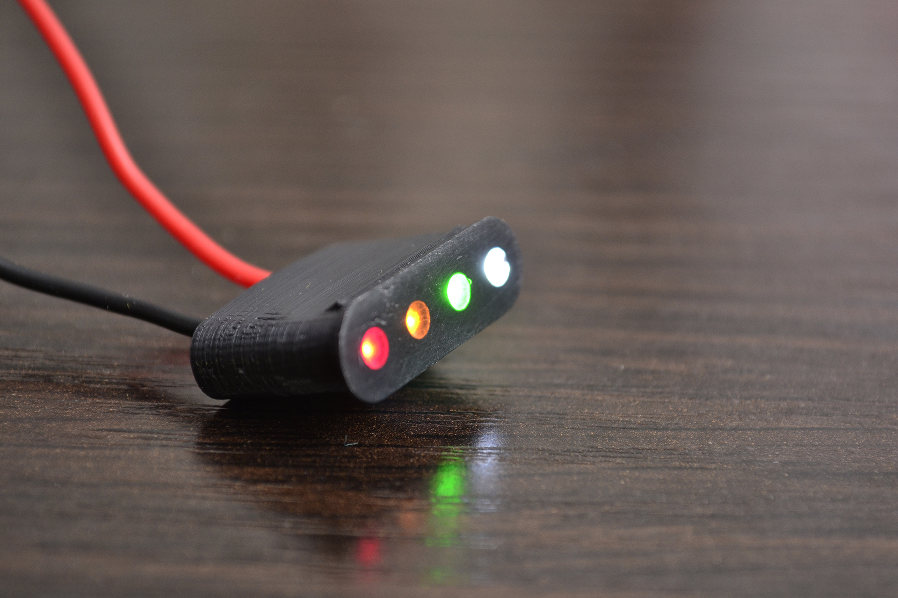
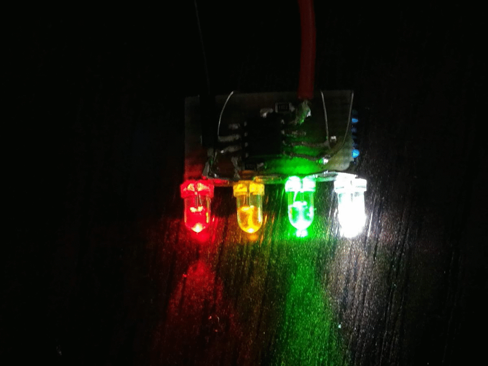
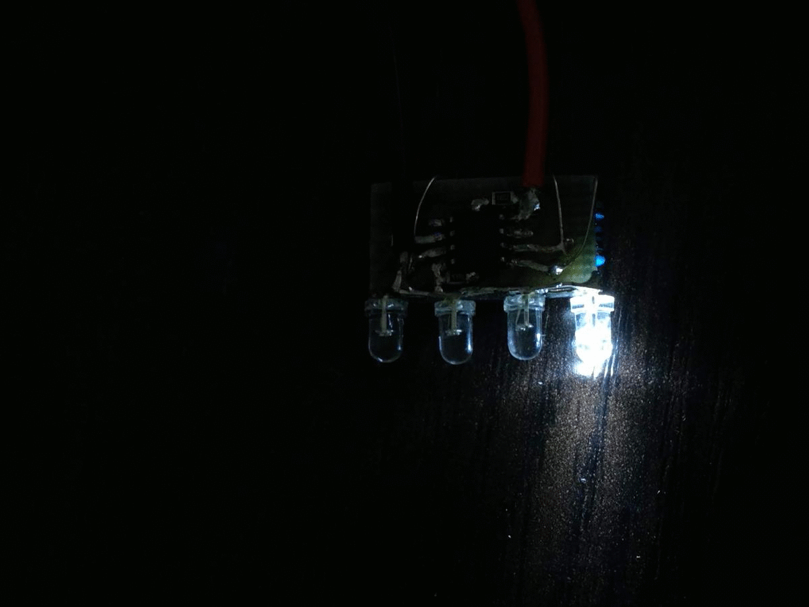
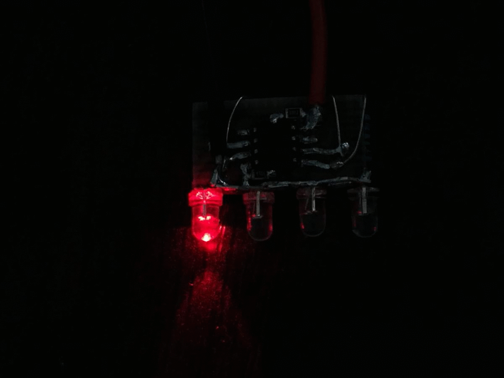
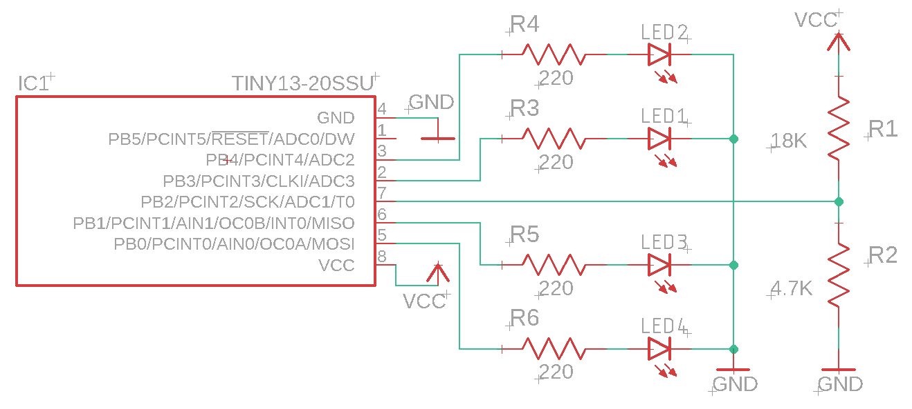
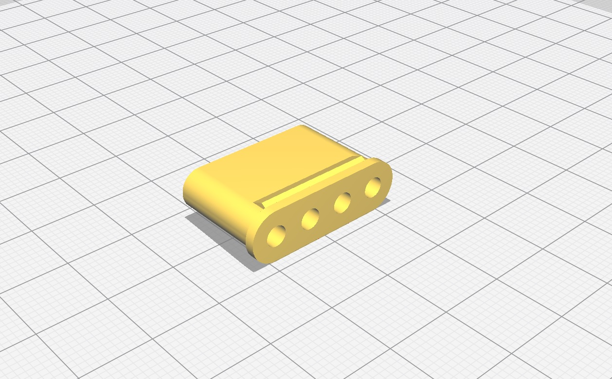

# Attiny13A based Li-ion battery level indicator

# Features

* 100% (> 3.9V), 75% (> 3.7V), 50% (> 3.5V), 25% (> 3.3V) indication
* Overvoltage (> 4.25V) and low voltage (< 3.3V) indication
* Two indication modes
* Input voltage: 2.7V to 5V

# Showcase

#### All LEDs / single LED mode

|||
|:-------:|:--------:|

#### Overvoltage

|||
|:-------:|:--------:|

#### Low voltage

# Circuit diagram

# 3D printable housing

STL file: `/hardware/housing.stl`

# Ways to support me

If you liked my project, feel free to say "Thank you" :blush:

|PayPal|Yandex.Money|
|:----:|:----------:|
|||
