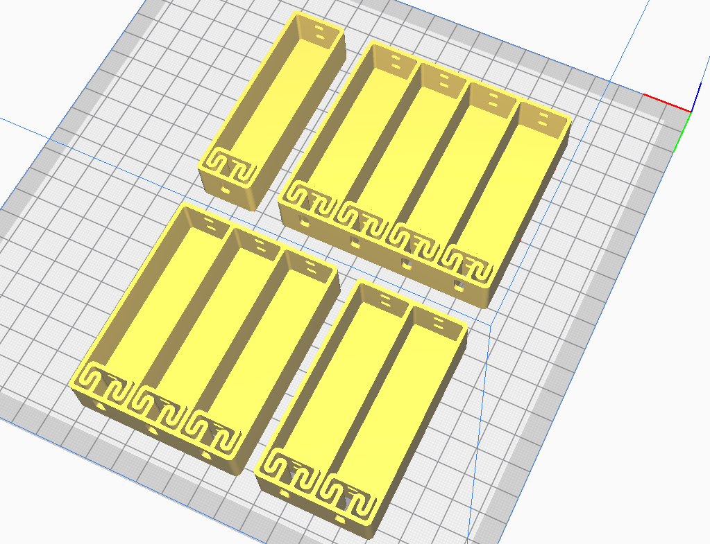
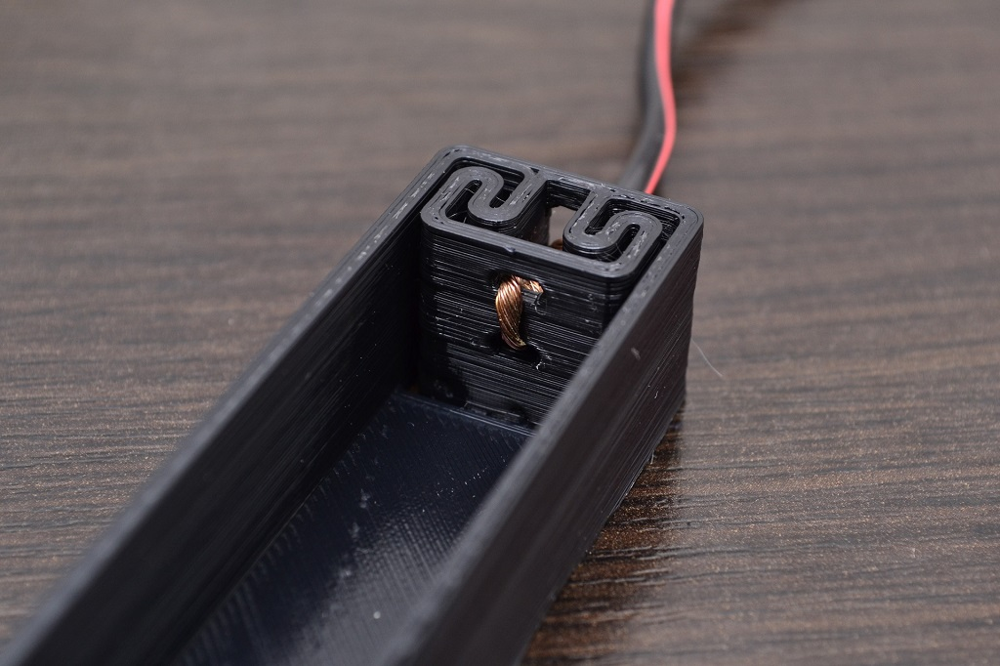
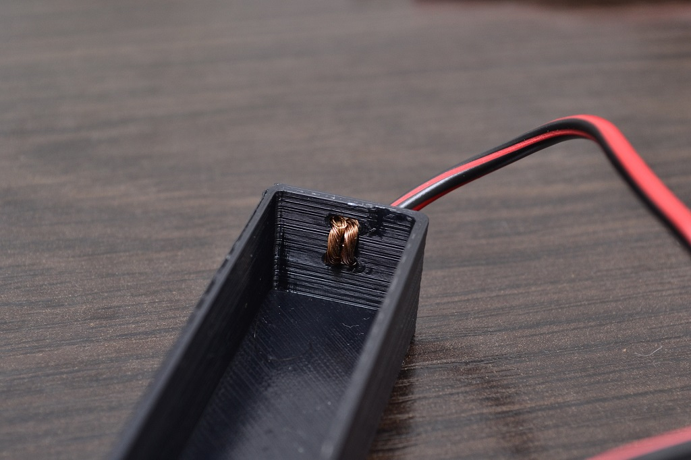
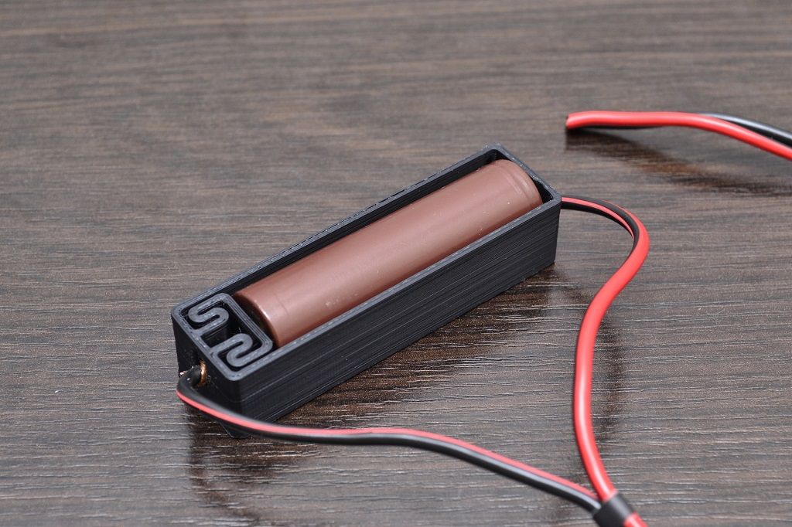

# Soldering-free 3D printable battery holders

* AAA: [x1](AAA/AAAx1.stl), [x2](AAA/AAAx2.stl), [x3](AAA/AAAx3.stl), [x4](AAA/AAAx4.stl)
* AA: [x1](AA/AAx1.stl), [x2](AA/AAx2.stl), [x3](AA/AAx3.stl), [x4](AA/AAx4.stl)
* 18650: [x1](18650/18650x1.stl), [x2](18650/18650x2.stl), [x3](18650/18650x3.stl), [x4](18650/18650x4.stl)
* 26650: [x1](26650/26650x1.stl), [x2](26650/26650x2.stl), [x3](26650/26650x3.stl), [x4](26650/26650x4.stl)

